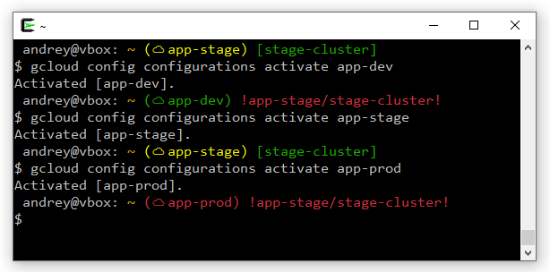

# GCloud Prompt

Helper script to display active gcloud configuration name and warn if current kubectl context has a GKE cluster from a different GCP project.

## Installation

1. Copy `gcloud-prompt.sh` file to somewhere (e.g. `~/.gcloud-prompt.sh`)
2. Add the following line to your .bashrc
```
    source ~/.gcloud-prompt.sh
```
3. Change your `PS1` to call `__gcloud_ps1` as command substitution:
```
    PS1='\u@\h: \w$(__gcloud_ps1) \$ '
```

GCloud configuration name will be displayed only if `~/.config/gcloud/active_config` file is present.

If profile name has `-dev`, `-qa`, `-test` or `-prod` suffix then additional coloring will be applied:

- green color for `-dev` suffix
- yellow color for `-test` and `-stage` suffixes
- red color for `-prod` suffix
- white color for the rest

GKE cluster name will be displayed only if the following conditions are met:

- `kubectl` executable is present in the PATH
- `~/.config/gcloud/active_config` file is present
- `~/.config/gcloud/configurations/config_<profile name>` file is present
- `project` is configured in `~/.config/gcloud/configurations/config_<profile name>` file
- kubectl context name is GKE specific (e.g. `gke_<project>_<location>_<cluster>`)

If GKE cluster from current context is not from the configured GCP project then additional warning and coloring will be applied.


